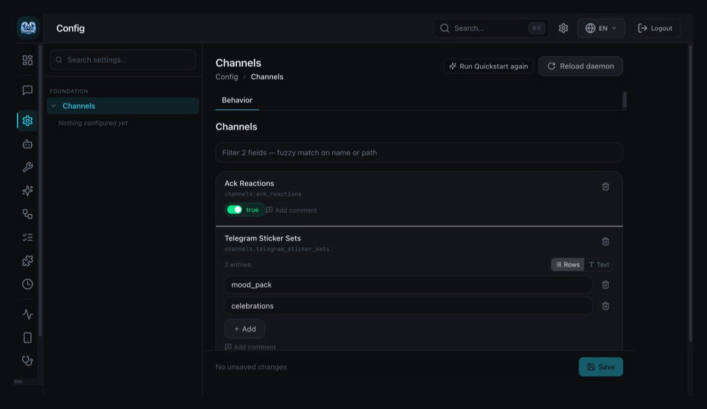

# Telegram Group Interactions

> This document is the current contract. See `./IMPLEMENTATION.md` for
> implementation coverage and `./HISTORY.md` for the decision record.

## Background

Telegram currently lacks an alias-scoped group authorization boundary,
reports generic reaction operations as successful without implementing the
Telegram Bot API call, and has no policy-controlled typed tool for outbound
stickers. These gaps make group deployment unsafe and leave Telegram behavior
behind other channel capabilities.

## Goals

- Authorize Telegram group and supergroup chats by exact numeric `chat.id`.
- Preserve the existing direct-message peer authorization and `/bind` flow.
- Implement truthful Telegram reaction add and remove operations.
- Let the agent send stickers selected by emoji from configured sticker sets,
  subject to normal action-tool policy and a per-turn quota.
- Document configuration, failure behavior, and trust boundaries.

## Non-goals

- Group membership does not authorize the same user in direct messages and is
  not copied into `peer_groups.external_peers`.
- Existing `/bind` compatibility in group chats is not changed.
- Inbound stickers are not understood, described, saved, or reused.
- Agents cannot provide raw Telegram `file_id` values.
- Sticker sets are not created or uploaded.
- Existing acknowledgement-reaction policy and issue #9387 are unchanged.

## Requirements

### Group authorization

- `channels.telegram.<alias>.allowed_groups` is the canonical alias-scoped list
  of permitted Telegram group chat IDs.
- An empty list preserves existing group behavior for upgrade compatibility.
- A non-empty list accepts only exact IDs for `group` and `supergroup` chats.
- Every sender in an allowed group may reach normal dispatch; sender-level peer
  authorization is not additionally required for that group message.
- Unlisted groups are silently rejected before pairing responses,
  acknowledgement reactions, media download, voice processing, or model calls.
- Direct messages continue through the existing peer-group authorization and
  `/bind` flow regardless of group authorization.
- `mention_only` is evaluated after the group authorization gate.

### Reactions

- Telegram implements channel reaction add and remove using Bot API
  `setMessageReaction`.
- Removal sends an empty reaction list.
- Both raw Telegram message IDs and the existing composite
  `telegram_<chat_id>_<message_id>` channel message IDs are accepted.
- Invalid identifiers, unsupported emoji, invalid messages, transport errors,
  and non-success Telegram responses return structured failures.

### Stickers

- Telegram sticker set names are configured once and shared by all Telegram
  aliases.
- The typed `sticker` tool is an action operation and remains subject to the
  configured risk profile and approval policy.
- The tool accepts an emoji selector, never a raw `file_id`.
- Sticker metadata is fetched on demand with `getStickerSet`; resolved metadata
  may use a bounded, non-persistent cache, while configuration remains the
  source of truth.
- Only exact emoji matches from configured sticker sets may be sent through
  `sendSticker`.
- At most three sticker sends may succeed in one agent turn. A fourth attempt
  fails without claiming success.
- Text and stickers may be delivered in either order. Existing `send_via`
  behavior owns text delivery before a sticker tool call. Sticker-only turns
  finish ordinary text delivery with the existing `NO_REPLY[INFO]` contract.
- Missing sets or matches, Telegram failures, and quota exhaustion are surfaced
  as tool failures and do not create empty messages.

## Interfaces And Ownership

| Interface | Kind | Scope | Change | Owner | Consumers |
| --- | --- | --- | --- | --- | --- |
| `allowed_groups` | Configuration | External | New | Telegram channel config | Telegram inbound listener |
| Telegram reaction capability | Channel API | Internal | Implement | Telegram channel adapter | Generic reaction tool |
| Telegram sticker sets | Configuration | External | New | Telegram type-level config | Sticker tool resolver |
| `sticker` tool | Tool API | External | New | Tool registry/runtime | Agent tool loop |

Canonical state remains in live configuration. Runtime handles may borrow or
resolve it, but must not create a second durable allowlist, sticker-set list,
or file-ID registry.

## Acceptance Criteria

- Given an allowed group and an addressed message, any group member can trigger
  the agent; the same unbound sender in a direct message follows existing
  authorization.
- Given an unlisted group, text, media, and voice events produce no response,
  reaction, download, or model call.
- Given raw or composite message IDs, valid reaction add/remove calls reach the
  correct Telegram message and API failures are returned.
- Given configured sticker sets, one to three exact emoji matches can be sent in
  text-before, text-after, or sticker-only turns; a fourth send fails.
- Given an unconfigured set, unmatched emoji, invalid message, or failed
  Telegram request, the operation fails without false success or empty output.

## Quality Gates

- Focused tests cover group authorization ordering across text, media, voice,
  direct-message, and mention-only paths.
- Focused tests cover reaction identifier parsing, add/remove payloads, and
  Telegram error propagation.
- Focused tests cover sticker lookup, cache bounds, tool policy, quota, delivery
  ordering, and sticker-only history behavior.
- Each child runs formatting, focused tests, and Clippy for its changed surface.
- The aggregate head runs the repository's full required CI on one recorded SHA.

## Visual Evidence

PR: none

Mock Channels settings render the shared Telegram sticker-set field as a
root-level editable string array.

## Related PRs

- None

## Risks And Assumptions

- Telegram chat IDs are matched as exact numeric values, not names or links.
- The empty group allowlist compatibility default intentionally retains the
  existing exposure and must be documented clearly.
- Sticker emoji metadata is provider-supplied and may not distinguish multiple
  stickers carrying the same emoji; selection must remain deterministic.
- This initiative operates only in `IvanLi-CN/zeroclaw`, targets its `master`,
  and does not mutate an external upstream repository.

## References

- `docs/book/src/architecture/channel-runtime-lifecycle.md`
- `docs/book/src/architecture/tool-execution-lifecycle.md`
- `docs/book/src/architecture/config-lifecycle.md`
- `docs/book/src/channels/telegram.md`
